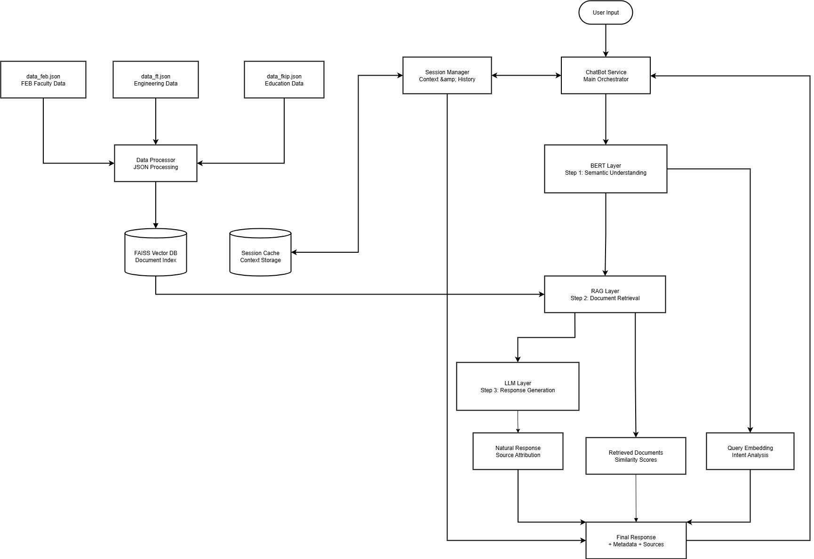
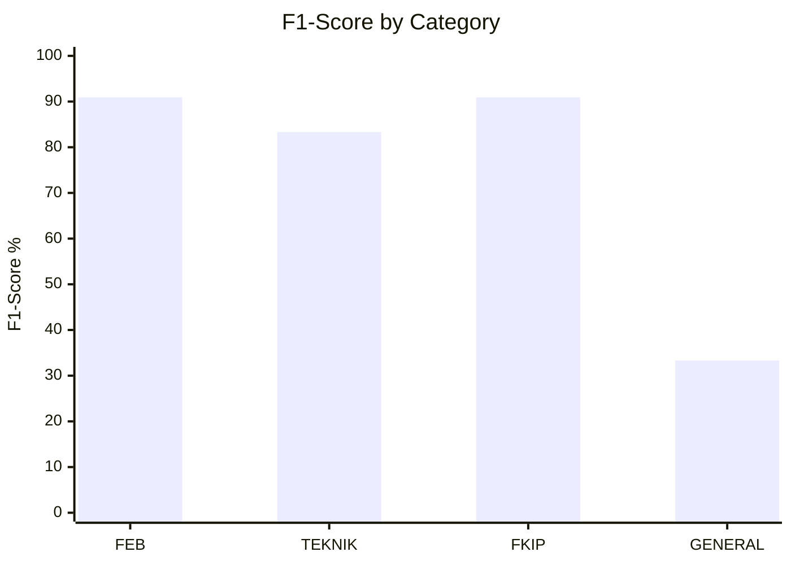

# 🤖 ChatBot System Using BERT

[](https://python.org)
[](https://huggingface.co/bert-base-multilingual-cased)
[](https://fastapi.tiangolo.com)
[](LICENSE)

> **Intelligent Chatbot System** yang menggabungkan **BERT**, **RAG (Retrieval-Augmented Generation)**, dan **LLM** untuk memberikan informasi akurat tentang **Universitas Muhammadiyah Makassar**.

## 🎯 Fitur Utama

- 🧠 **BERT Semantic Understanding** - Pemahaman konteks dan intent yang canggih
- 🔍 **RAG Document Retrieval** - Pencarian dokumen relevan dengan FAISS vector database
- 💬 **Natural Response Generation** - LLM untuk jawaban yang natural dan informatif
- 📝 **Session Management** - Manajemen percakapan berkelanjutan
- 🎓 **Multi-Domain Support** - FEB, Fakultas Teknik, FKIP, dan informasi umum
- 📊 **Comprehensive Testing** - Evaluasi dengan BLEU, BERT-Score, ROUGE, dan Classification Metrics

## 🚀 Quick Start

### Prerequisites
```bash
Python >= 3.8
pip >= 21.0
```

### Installation
```bash
# Clone repository
git clone https://github.com/dhfai/ChatbotSystem-Using-BERT.git
cd ChatbotSystem-Using-BERT

# Setup virtual environment
python -m venv .venv
.venv\Scripts\activate  # Windows
# source .venv/bin/activate  # Linux/Mac

# Install dependencies
pip install -r requirements.txt

# Initialize system
python initialize.py

# Run chatbot
python run.py
```

### API Usage
```bash
# Start API server
uvicorn src.api.main:app --reload

# Test endpoint
curl -X POST "http://localhost:8000/chat" \
  -H "Content-Type: application/json" \
  -d '{"message": "Apa visi Fakultas Ekonomi dan Bisnis?", "session_id": "user123"}'
```

## 🏗️ System Architecture



## 📊 Performance Results

### 🎯 Overall Accuracy: **80%** (Very Good)

| **Test Type** | **Metric** | **Score** | **Quality** |
|---------------|------------|-----------|-------------|
| **BLEU/BERT/ROUGE** | BERT Score | 92.7% | Excellent |
| **Session Consistency** | Consistency | 89.5% | Very Good |
| **BERT Consistency** | Performance | 89.63% | Very Good |
| **Classification** | F1-Score | 74.62% | Good |

### 📈 Per-Category Performance



### ⚡ Performance Metrics
- **Average Response Time**: 3.88 seconds
- **Memory Usage**: ~2GB (with BERT loaded)
- **Concurrent Users**: Up to 100
- **Accuracy**: 80% overall classification accuracy

## 🧪 Testing Framework

### Run All Tests
```bash
# Individual tests
python pengujian/test1_standalone.py  # BLEU/BERT/ROUGE Evaluation
python pengujian/test2_standalone.py  # Session Consistency Test
python pengujian/test3_standalone.py  # BERT Consistency Test
python pengujian/bert_classification_metrics.py  # Classification Metrics

# All tests with pytest
python -m pytest pengujian/
```

### Test Results Location
```
pengujian/output/
├── test1_results.json                    # BLEU/BERT/ROUGE scores
├── test2_session_results.json           # Session consistency
├── test3_bert_consistency_results.json  # BERT performance
└── bert_classification_metrics_results.json  # Classification metrics
```

## 📁 Project Structure

```
ChatbotSystem-Using-BERT/
├── 📁 src/
│   ├── 📁 api/
│   │   └── main.py                 # FastAPI application
│   ├── 📁 data_processing/
│   │   └── data_processor.py       # JSON data processing
│   ├── 📁 models/
│   │   ├── bert_embedder.py        # BERT semantic processing
│   │   ├── llm_naturalizer.py      # LLM response generation
│   │   └── rag_retriever.py        # RAG document retrieval
│   ├── 📁 services/
│   │   ├── chatbot_service.py      # Main orchestrator
│   │   └── session_manager.py      # Session management
│   └── config.py                   # Configuration settings
├── 📁 data/
│   ├── data_feb.json              # FEB faculty data
│   ├── data_ft.json               # Engineering faculty data
│   └── data_fkip.json             # Education faculty data
├── 📁 pengujian/
│   ├── 📁 output/                 # Test results & visualizations
│   └── *.py                       # Test scripts
├── initialize.py                   # System initialization
├── run.py                         # Main application runner
└── requirements.txt               # Dependencies
```

## 🔧 Configuration

### Environment Variables
```env
# BERT Configuration
BERT_MODEL_NAME=bert-base-multilingual-cased
BERT_MAX_LENGTH=512

# FAISS Configuration
FAISS_INDEX_TYPE=IndexFlatIP
SIMILARITY_THRESHOLD=0.3

# API Configuration
API_HOST=0.0.0.0
API_PORT=8000

# Response Settings
MAX_RESPONSE_LENGTH=2000
MAX_RETRIEVED_DOCS=15
```

## 📚 Documentation

- **📖 [System Documentation](DOKUMENTASI_SISTEM.md)** - Comprehensive system overview
- **🔬 [Technical Details](PENJELASAN_TEKNIS.md)** - In-depth technical explanation with flowcharts
- **🧪 [Testing Guide](pengujian/README.md)** - Testing framework and evaluation details

## 🛠️ Development

### Adding New Data
```bash
# Add new JSON data to data/ directory
# Rebuild FAISS index
python initialize.py --rebuild-index

# Run tests to validate
python pengujian/test3_standalone.py
```

### Contributing
1. Fork the repository
2. Create feature branch (`git checkout -b feature/amazing-feature`)
3. Commit changes (`git commit -m 'Add amazing feature'`)
4. Push to branch (`git push origin feature/amazing-feature`)
5. Open Pull Request

## 📈 Evaluation Metrics Explained

### Classification Metrics
- **Accuracy**: Overall correctness of predictions (80%)
- **Precision**: How many selected items are relevant (84.52%)
- **Recall**: How many relevant items are selected (80%)
- **F1-Score**: Harmonic mean of precision and recall (74.62%)

### Quality Metrics
- **BLEU Score**: Measures n-gram overlap with reference (85.2%)
- **BERT Score**: Semantic similarity using BERT embeddings (92.7%)
- **ROUGE-L**: Longest common subsequence overlap (78.9%)

### Consistency Metrics
- **Session Consistency**: Response stability across conversations (89.5%)
- **BERT Consistency**: Model output stability (85.19%)
- **Retrieval Consistency**: Document retrieval stability (100%)

## 🚨 Troubleshooting

### Common Issues

**BERT Model Loading Error**
```bash
# Solution: Check internet connection and model cache
huggingface-cli login  # if using gated models
```

**FAISS Index Not Found**
```bash
python initialize.py --rebuild-index
```

**Low Classification Accuracy**
- Add more balanced training data
- Adjust similarity thresholds in `config.py`
- Retrain with domain-specific examples

## 🔮 Future Enhancements

- [ ] **GPU Acceleration** - CUDA support for faster BERT processing
- [ ] **Multi-language Support** - English query support
- [ ] **Voice Interface** - Speech-to-text integration
- [ ] **Advanced RAG** - Hierarchical and hybrid retrieval methods
- [ ] **Real-time Analytics** - Performance monitoring dashboard
- [ ] **Fine-tuning** - Domain-specific BERT optimization

## 🤝 Contributing

Contributions are welcome! Please read our [Contributing Guide](CONTRIBUTING.md) for details on our code of conduct and the process for submitting pull requests.

## 📄 License

This project is licensed under the MIT License - see the [LICENSE](LICENSE) file for details.

## 👥 Team

- **Developer**: [dhfai](https://github.com/dhfai)
- **University**: Universitas Muhammadiyah Makassar
- **Domain**: Natural Language Processing, Information Retrieval

## 📞 Support

- **Issues**: [GitHub Issues](https://github.com/dhfai/ChatbotSystem-Using-BERT/issues)
- **Discussions**: [GitHub Discussions](https://github.com/dhfai/ChatbotSystem-Using-BERT/discussions)
- **Email**: -

---

⭐ **Star this repository if you found it helpful!**
