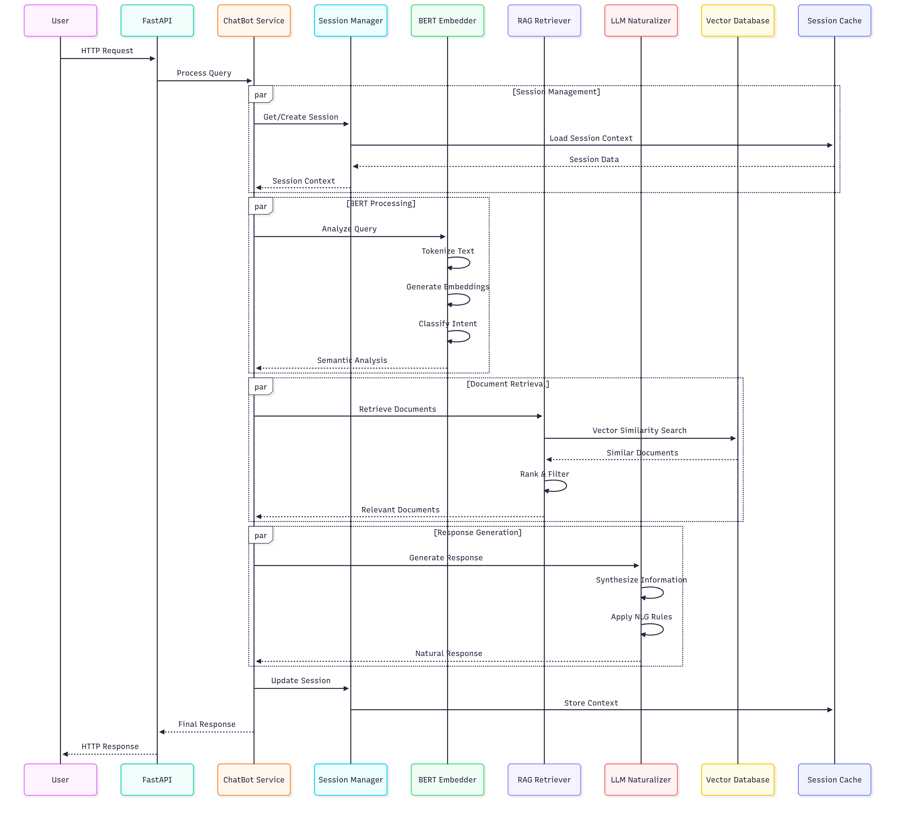
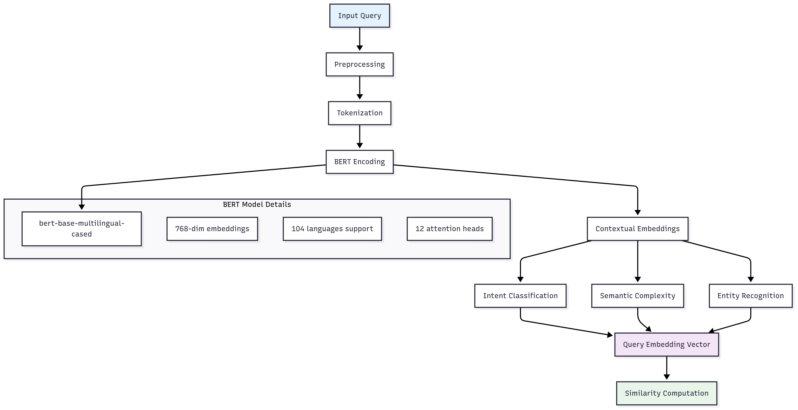
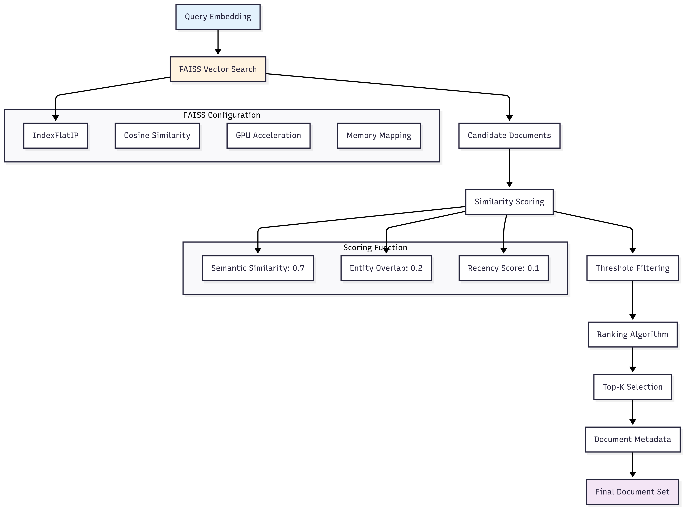
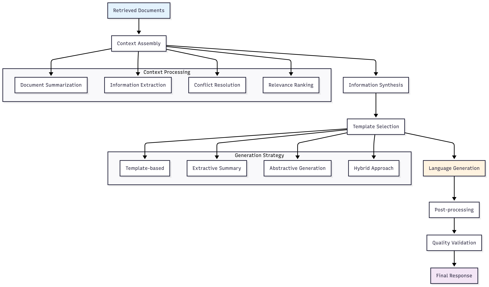
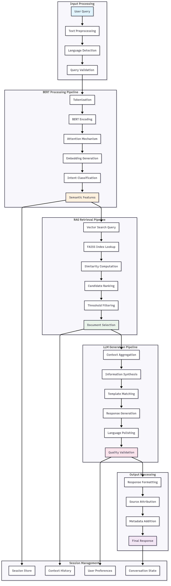
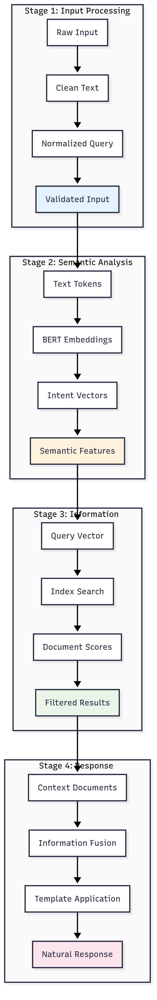
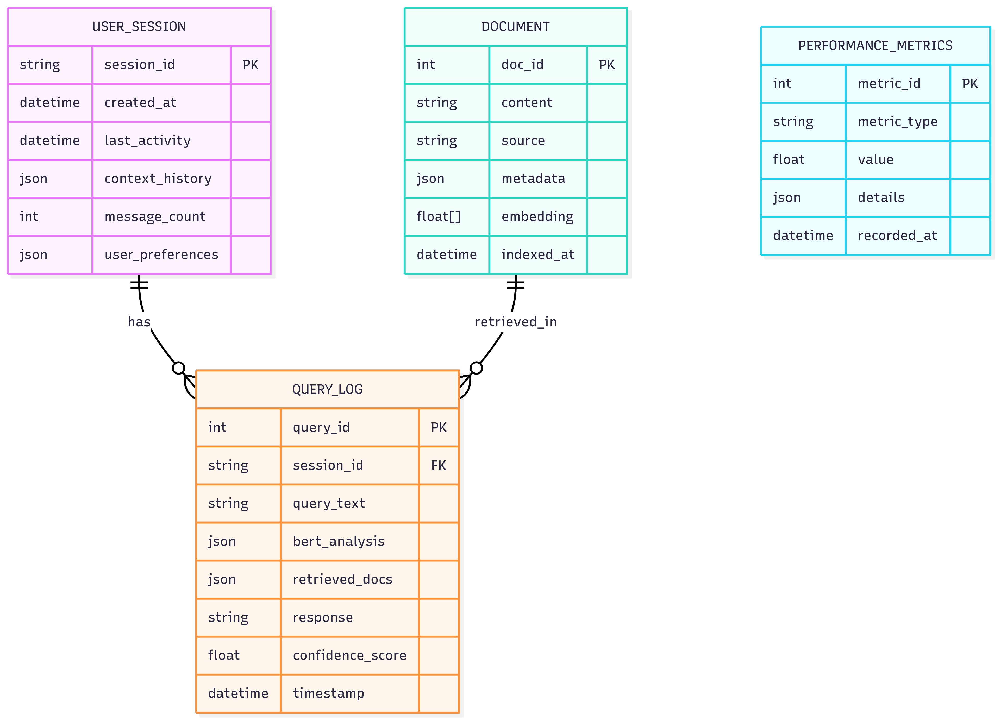

# 🔬 PENJELASAN TEKNIS SISTEM CHATBOT USING BERT

## 📋 Daftar Isi
- [Arsitektur Teknis](#arsitektur-teknis)
- [Algoritma dan Model](#algoritma-dan-model)
- [Data Flow Architecture](#data-flow-architecture)
- [Implementation Details](#implementation-details)
- [Performance Analysis](#performance-analysis)
- [Technical Specifications](#technical-specifications)

---

## 🏗️ Arsitektur Teknis

### Component Interaction Flow



---

## 🤖 Algoritma dan Model

### 1. BERT Semantic Understanding


**Algorithm**:
```python
def process_query_bert(query_text):
    # 1. Text preprocessing
    cleaned_text = preprocess_text(query_text)

    # 2. Tokenization
    tokens = tokenizer.encode(cleaned_text, max_length=512, truncation=True)

    # 3. BERT forward pass
    with torch.no_grad():
        outputs = bert_model(torch.tensor([tokens]))
        embeddings = outputs.last_hidden_state

    # 4. Pooling strategy (CLS token + mean pooling)
    cls_embedding = embeddings[0][0]  # CLS token
    mean_embedding = embeddings[0][1:].mean(dim=0)  # Mean of other tokens
    final_embedding = (cls_embedding + mean_embedding) / 2

    # 5. Intent classification
    intent_scores = classify_intent(final_embedding)

    return {
        'embedding': final_embedding,
        'intent': intent_scores,
        'complexity': calculate_complexity(embeddings),
        'entities': extract_entities(tokens)
    }
```

### 2. RAG Retrieval System


**Algorithm**:
```python
def retrieve_documents_rag(query_embedding, k=15, threshold=0.3):
    # 1. FAISS similarity search
    similarities, indices = faiss_index.search(
        query_embedding.reshape(1, -1), k=k*2
    )

    # 2. Filter by threshold
    valid_indices = indices[0][similarities[0] > threshold]
    valid_similarities = similarities[0][similarities[0] > threshold]

    # 3. Enhanced scoring
    scored_docs = []
    for idx, sim_score in zip(valid_indices, valid_similarities):
        doc = document_store[idx]

        # Composite scoring
        semantic_score = sim_score * 0.7
        entity_score = calculate_entity_overlap(query_embedding, doc) * 0.2
        recency_score = calculate_recency(doc) * 0.1

        final_score = semantic_score + entity_score + recency_score
        scored_docs.append((doc, final_score))

    # 4. Sort and return top-k
    scored_docs.sort(key=lambda x: x[1], reverse=True)
    return scored_docs[:k]
```

### 3. LLM Response Generation


**Algorithm**:
```python
def generate_response_llm(retrieved_docs, query_context):
    # 1. Context assembly
    context_parts = []
    for doc, score in retrieved_docs:
        summary = summarize_document(doc, max_length=200)
        context_parts.append(f"[Score: {score:.3f}] {summary}")

    combined_context = "\n".join(context_parts)

    # 2. Template selection based on query type
    if query_context['intent']['is_question']:
        template = QUESTION_TEMPLATE
    elif query_context['intent']['is_seeking_advice']:
        template = ADVICE_TEMPLATE
    else:
        template = GENERAL_TEMPLATE

    # 3. Information synthesis
    key_points = extract_key_information(combined_context)
    structured_info = organize_information(key_points)

    # 4. Natural language generation
    response = generate_natural_response(
        template=template,
        context=structured_info,
        style='informative',
        max_length=1000
    )

    # 5. Post-processing
    response = post_process_response(response)
    quality_score = validate_response_quality(response, query_context)

    return {
        'response': response,
        'sources': [doc['source'] for doc, _ in retrieved_docs],
        'confidence': quality_score,
        'context_used': len(retrieved_docs)
    }
```

---

## 📊 Data Flow Architecture

### Complete System Data Flow


### Data Processing Stages Detail


---

## 🔧 Implementation Details

### 1. Data Structure Design



---


*Dokumentasi Teknis ini dibuat pada September 14, 2025*
*Version: 1.0.0*
*Author: dhf.ai*
