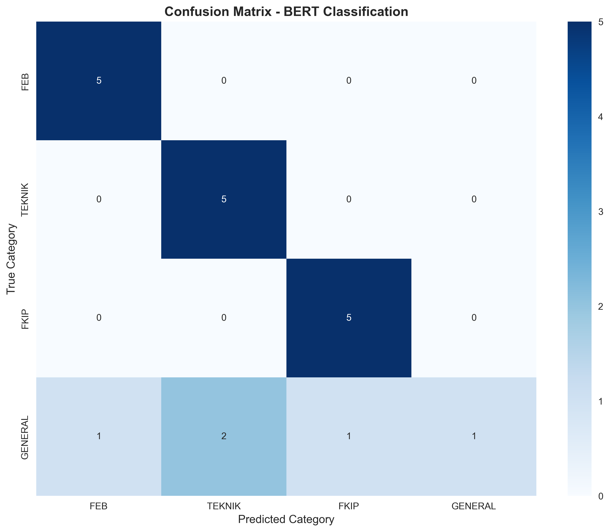
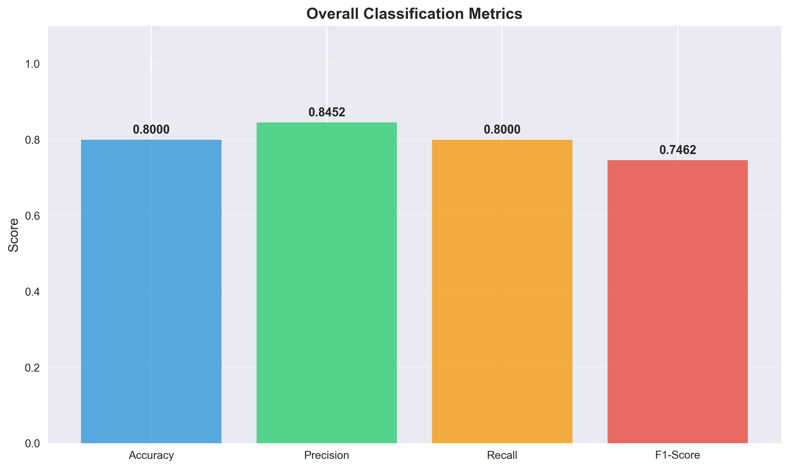
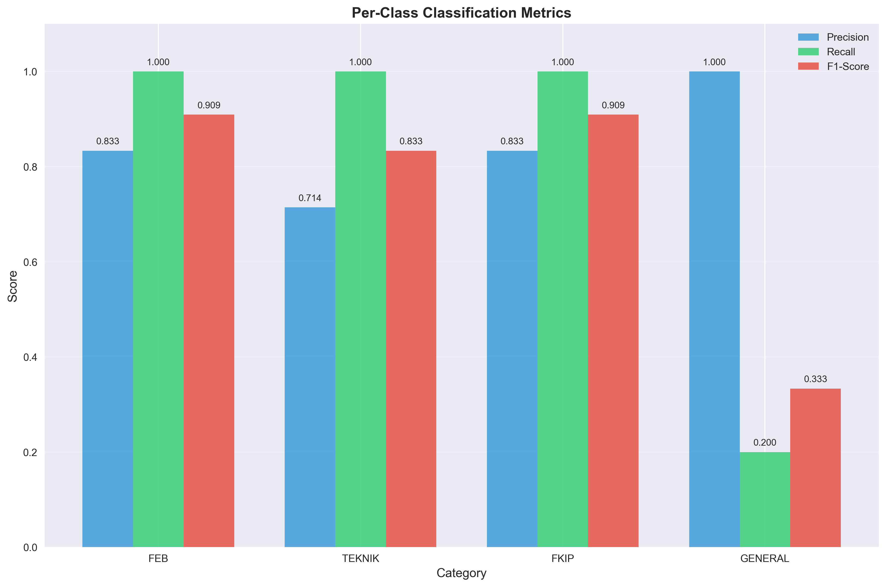
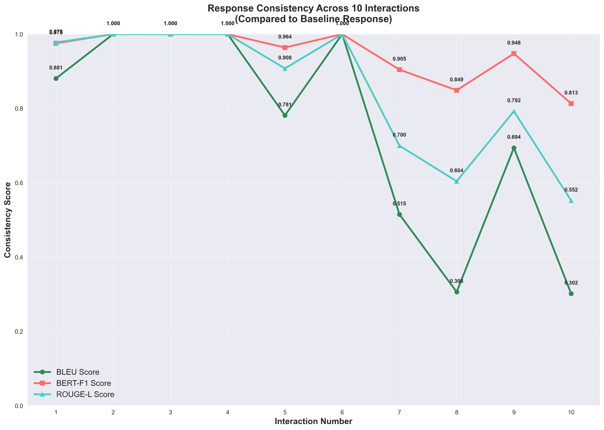

# 📊 Visualisasi Hasil Evaluasi Chatbot System

## Gambaran Umum

Dokumen ini menampilkan visualisasi grafik dari berbagai evaluasi yang telah dilakukan pada sistem chatbot menggunakan BERT, RAG, dan LLM. Semua grafik dihasilkan secara otomatis dari script evaluasi dan disimpan dalam folder `output/`.

---

## 🤖 Evaluasi Akurasi Model BERT

### Confusion Matrix BERT Classification
Matriks konfusi menunjukkan performa klasifikasi model BERT untuk berbagai kategori intent dan topik.



**Interpretasi:**
- Diagonal utama menunjukkan prediksi yang benar
- Nilai off-diagonal menunjukkan kesalahan klasifikasi
- Warna yang lebih terang menunjukkan akurasi yang lebih tinggi

---

### Overall Metrics BERT Model
Grafik ini menampilkan metrik keseluruhan performa model BERT.



**Metrik yang ditampilkan:**
- **Accuracy**: Akurasi keseluruhan model
- **Precision**: Tingkat ketepatan prediksi positif
- **Recall**: Tingkat deteksi kasus positif yang benar
- **F1-Score**: Harmonic mean dari precision dan recall

---

### Per-Class Metrics BERT Model
Detail performa model BERT untuk setiap kelas/kategori secara terpisah.



**Informasi per kelas:**
- Precision untuk setiap kategori
- Recall untuk setiap kategori
- F1-Score untuk setiap kategori
- Support (jumlah sampel) untuk setiap kategori

---

## 📈 Evaluasi Konsistensi Sesi

### Consistency Curve
Grafik yang menunjukkan tingkat konsistensi respons chatbot selama sesi berlangsung.



**Analisis Kurva Konsistensi:**
- **Sumbu X**: Jumlah interaksi dalam sesi
- **Sumbu Y**: Skor konsistensi (0-1)
- **Trend**: Menunjukkan apakah konsistensi meningkat atau menurun seiring waktu
- **Target**: Konsistensi yang tinggi dan stabil

---

## 📋 Ringkasan Hasil Evaluasi

### Test 1: Two Questions Evaluation
**File Data:** `output/test1_two_questions_results.json`

Evaluasi dengan menggunakan metrik:
- BLEU Score untuk similarity
- BERT Score untuk semantic similarity
- ROUGE Score untuk overlap content

### Test 2: Session Interactions Evaluation
**File Data:** `output/test2_session_interactions_results.json`

Evaluasi konsistensi dan koherensi dalam:
- Multi-turn conversations
- Context retention
- Response relevance

### Test 3: BERT Classification Metrics
**File Data:** `output/bert_classification_metrics_results.json`

Evaluasi mendalam pada:
- Classification accuracy
- Precision, Recall, F1-Score
- Confusion matrix analysis
- Per-class performance

---

## 🔍 Cara Membaca Visualisasi

### Confusion Matrix
```
              Predicted
           A    B    C
Actual A [100]  [5]  [2]  <- A diprediksi benar 100 kali
       B  [3] [95]  [4]  <- B ada 3 false positive ke A
       C  [1]  [6] [88]  <- C ada kesalahan ke A dan B
```

### Metrics Bar Chart
- **Hijau Tua**: Excellent (>0.9)
- **Hijau Muda**: Good (0.7-0.9)
- **Kuning**: Fair (0.5-0.7)
- **Merah**: Needs Improvement (<0.5)

### Consistency Curve
- **Naik**: Sistem belajar dan konsisten
- **Datar**: Konsistensi stabil
- **Turun**: Kemungkinan overfitting atau degradasi

---

## 📊 Template Interpretasi Hasil

### Untuk BERT Classification:
1. **Akurasi > 85%**: Model sangat baik
2. **Akurasi 70-85%**: Model cukup baik, bisa dioptimasi
3. **Akurasi < 70%**: Perlu improvement signifikan

### Untuk Session Consistency:
1. **Konsistensi > 0.8**: Chatbot sangat konsisten
2. **Konsistensi 0.6-0.8**: Cukup konsisten
3. **Konsistensi < 0.6**: Perlu perbaikan dialog management

---

## 🚀 Cara Menjalankan Evaluasi

### Menjalankan Semua Test
```bash
cd pengujian
python run_all_evaluations.py
```

### Menjalankan Test Individu
```bash
# Test 1: BLEU/BERT/ROUGE evaluation
python test1_standalone.py

# Test 2: Session consistency
python test2_standalone.py

# Test 3: BERT classification metrics
python bert_classification_metrics.py
```

### Melihat Hasil Evaluasi
```bash
python view_evaluation_results.py
```

---

## 📝 Catatan Penting

1. **File Gambar**: Semua grafik disimpan dalam format PNG di folder `output/`
2. **File Data**: Data mentah tersimpan dalam format JSON untuk analisis lebih lanjut
3. **Update Otomatis**: Grafik akan diperbarui setiap kali evaluasi dijalankan
4. **Resolusi**: Gambar disimpan dalam resolusi tinggi untuk presentasi

---

## 🔄 Maintenance dan Update

### Membersihkan Output Lama
```bash
python clean_outputs.py
```

### Memvalidasi Dependencies
```bash
python check_dependencies.py
```

### Backup Hasil Evaluasi
Disarankan untuk backup folder `output/` secara berkala untuk tracking progress evaluasi dari waktu ke waktu.

---

*Dokumen ini diperbarui secara otomatis setiap kali evaluasi sistem dijalankan. Untuk informasi teknis lebih detail, lihat `PENJELASAN_TEKNIS.md` dan `DOKUMENTASI_SISTEM.md`.*
